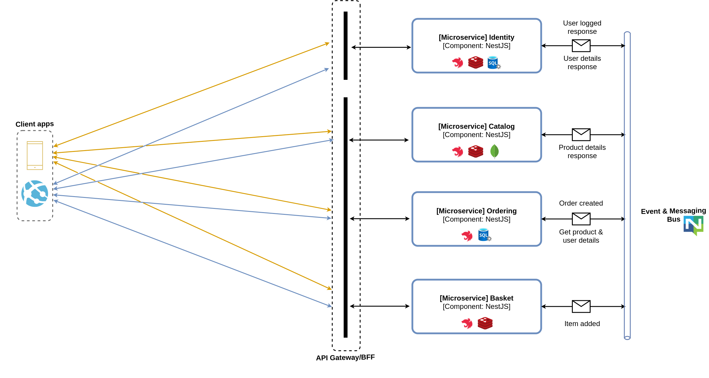

# eSHOP Distributed Architecture :sunglasses:

- Sample Node/Nest reference architecture, based on a simplified microservices architeture, distributed systems and docker containers.

## Architecture overview :heavy_check_mark:

- SOLID
- DDD
- Clean Architecture
- This services capable of running on Linux containers in your Docker host
- The project proposes a microservice oriented architecture implementation with multiple bounted contexts (each one owing its a own data/db)
- Implementing differents approaches of communications (simple communication protocol using http beteween the client apps and microservices and asyncrhonous communication based messages and events)

## Give a Star! :star:

If you liked the project, please give a star ;)

## You need some of the fallowing tools :exclamation:

- Visual Studio Code
- NodeJS
- NestJS

